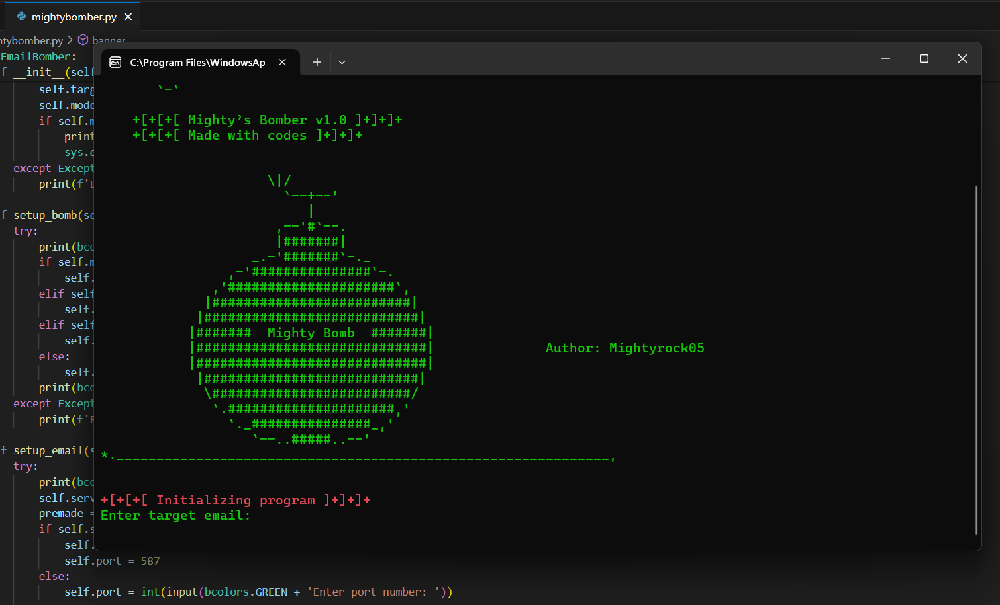

# Mighty’s Bomber v1.0

Welcome to **Mighty’s Bomber v1.0**! 🚀

This is a Python-based email bomber designed for educational purposes and to help you understand the potential vulnerabilities associated with email systems. **Mighty's Bomber v1.0** demonstrates basic principles of sending emails in bulk but should never be used for malicious activities.



## Features

- **Customizable Email Bombing Modes**: Choose from predefined modes or set a custom number of emails to send.
- **Support for Multiple Email Providers**: Configure the tool for Gmail, Yahoo, Outlook, or any SMTP server.
- **Simple and Interactive Interface**: Easily configure your email settings and bombing parameters.

## Usage

 **Run the Program**
   ```bash
   python mightybomber.py

